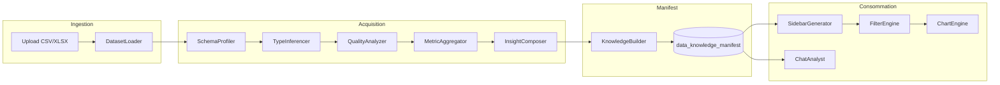

# Architecture — Plateforme universelle Data Intelligence

_Version 1.0 — Juillet 2026_  
**Handbook** — document maître pour implémentation V2.

---

## Chapitre 1 — Vision

### 1.1 Thèse

> **TAYIER OS Data Intelligence ne visualise pas directement un fichier. Il construit d'abord une connaissance structurée du dataset (Data Knowledge Manifest), génère une sidebar de filtres depuis les propriétés détectées, affiche graphiques et tableaux — puis répond en langage naturel.**

### 1.2 Évolution V1 → V2

| V1 (livré) | V2 (cible) |
|------------|------------|
| Dataset DPE fixe (+800k) | **N'importe quel** CSV/Excel |
| `TableFactory` + 6 JSON | DKM + vues dérivées |
| Filtres JS codés en dur | Sidebar dynamique |
| ApexCharts pages fixes | Chart engine générique |
| Pas de chat | Chat Analyst KM-only |

### 1.3 Application vs plateforme

| Logique application (V1) | Logique plateforme (V2) |
|--------------------------|-------------------------|
| Pipeline DPE → JSON charts | **Knowledge Acquisition** → DKM |
| `config_data_DPE.json` | `schema` inféré |
| Utilisateur ouvre dashboard | Utilisateur upload → **analyse d'abord** |

---

## Chapitre 2 — Architecture 5 couches

```text
┌─────────────────────────────────────────────────────────────┐
│ COUCHE 5 — UI                                               │
│  Upload · Sidebar · Charts · Table · Chat                   │
├─────────────────────────────────────────────────────────────┤
│ COUCHE 4 — API Django                                       │
│  /datasets/upload · /analyze · /knowledge · /filter · /chat │
├─────────────────────────────────────────────────────────────┤
│ COUCHE 3 — Decision Engine                                  │
│  RuleEngine · TechSelector · ChatAnalyst · DialogueGate     │
├─────────────────────────────────────────────────────────────┤
│ COUCHE 2 — Knowledge Acquisition (services parallèles)      │
│  SchemaProfiler · TypeInferencer · MetricAggregator · …       │
├─────────────────────────────────────────────────────────────┤
│ COUCHE 1 — Stockage                                         │
│  source file · knowledge_manifest.json · snapshots            │
└─────────────────────────────────────────────────────────────┘
```

---

## Chapitre 3 — Flux données



---

## Chapitre 4 — Deux manifestes

| Artefact | Rôle | Moment |
|----------|------|--------|
| `data_knowledge_manifest` | Anatomie pré-visualisation | Après `analyze` |
| `export_report_manifest` | Traçabilité export PDF/Excel | Après `export` |

**Ne pas confondre** avec JSON dashboard V1 (`table_financial.json`).

---

## Chapitre 5 — Services (mapping code)

### 5.1 Existant V1 → rôle V2

| Module V1 | Chemin | Rôle V2 |
|-----------|--------|---------|
| `Data_loader` | `data_laoder_cleaner.py` | Base `DatasetLoader` |
| `Make_new_df` | `data_make_new_df_DPE.py` | Transform domain-specific (DPE) |
| `TableFactory` | `table_factory.py` | **Legacy view exporter** + schema-data |
| `pipeline_DPE` | `pipeline_DPE.py` | Job DPE builtin + régression |
| `api_dashboard_data` | `data/views.py` | Legacy API préservée |

### 5.2 Nouveaux modules V2 (cible)

```text
data/
  services/
    acquisition/          # NEW — producteurs DKN
      dataset_loader.py
      schema_profiler.py
      type_inferencer.py
      cardinality_analyzer.py
      numeric_stats.py
      quality_analyzer.py
      metric_aggregator.py
      insight_composer.py
      knowledge_builder.py
    runtime/              # NEW — filtre, chart
      filter_engine.py
      chart_engine.py
      sidebar_generator.py
    intelligence/         # NEW — chat (jalon D)
      chat_analyst.py
      dialogue_gate.py
    data_processing/      # EXISTING — DPE legacy
```

---

## Chapitre 6 — API REST (V2)

| Route | Méthode | Description |
|-------|---------|-------------|
| `/api/datasets/upload` | POST | multipart file → `dataset_id` |
| `/api/datasets/{id}/analyze` | POST | Lance acquisition → DKM |
| `/api/datasets/{id}/knowledge` | GET | Manifest + slices_count |
| `/api/datasets/{id}/sidebar` | GET | Spec filtres UI |
| `/api/datasets/{id}/filter` | POST | Applique filtres → preview |
| `/api/datasets/{id}/chart` | POST | `{ chart_spec }` → données chart |
| `/api/datasets/{id}/chat` | POST | `{ message }` → réponse NL |
| `/api/dashboard/{filename}/` | GET | **Legacy V1** inchangé |

---

## Chapitre 7 — Decision Engine

| Sous-moteur | Entrée | Sortie |
|-------------|--------|--------|
| TechnologySelector | taille fichier, RAM | pandas vs DuckDB sample |
| RuleEngine | `quality.confidence` | `needs_user_review` |
| ChartRecommender | schema roles | `views.default_chart` |
| ChatAnalyst | DKM subset + NL | texte + citations |
| DialogueGate | ambiguïtés | questions pending |

**ADR-002 :** ChatAnalyst ne reçoit jamais `DataFrame` complet.

---

## Chapitre 8 — Chart engine (générique)

| Condition | Chart type |
|-----------|------------|
| dimension(low) + measure | `bar` sum |
| time + measure | `line` sum by month |
| 2 dimensions | `stacked_bar` |
| 1 measure seul | `kpi_card` |
| default | `table` |

Librairie : ApexCharts (V1) ou Recharts (React V2).

---

## Chapitre 9 — MCP (jalon E)

Tools cibles (pattern SNORBIK Cut) :

| Tool | Action |
|------|--------|
| `analyze_dataset` | Upload path → DKM |
| `get_knowledge` | Manifest + slices |
| `query_metric` | Métrique par id |
| `apply_filter` | Filtres JSON |
| `preview_chart` | Chart spec |
| `export_report` | PDF/HTML |

---

## Chapitre 10 — Sécurité

- `@login_required` sur toutes routes datasets
- Whitelist extensions `.csv`, `.xlsx`, `.xls`
- Taille max configurable
- Pas d'exécution code utilisateur
- LLM : pas de PII brute dans prompts (masquage optionnel colonnes `text`)

---

## Chapitre 11 — Jalons et DoD

| Jalon | DoD |
|-------|-----|
| **0** | Docs `docs/data_intelligence/` complets |
| **A** | `analyze_dataset` + DKM sur CSV test 10k lignes < 15 s |
| **B** | Sidebar 100 % dérivée schema, SB-01 à SB-05 verts |
| **C** | Chart générique + tableau filtré |
| **D** | Chat 10 questions types sans lire CSV |
| **E** | MCP 3 tools + export rapport |
| **REG** | DPE dashboard V1 équivalent + DKM |

---

## Chapitre 12 — Références

| Doc | Lien |
|-----|------|
| Index | [README.md](./README.md) |
| Manifest spec | [DATA_KNOWLEDGE_MANIFEST_SPEC.md](./DATA_KNOWLEDGE_MANIFEST_SPEC.md) |
| Parcours | [USER_JOURNEY_UPLOAD_TO_VIZ.md](./USER_JOURNEY_UPLOAD_TO_VIZ.md) |
| Questions | [QUESTIONS_CATALOG_UNIVERSAL.md](./QUESTIONS_CATALOG_UNIVERSAL.md) |
| Types DKN | [DATA_KNOWLEDGE_CATALOG.md](./DATA_KNOWLEDGE_CATALOG.md) |
| Sidebar | [SIDEBAR_FILTER_SPEC.md](./SIDEBAR_FILTER_SPEC.md) |
| Migration | [MIGRATION_NEXUS_V1_TO_V2.md](./MIGRATION_NEXUS_V1_TO_V2.md) |
| SNORBIK ref | `snorbik-cut/docs/ARCHITECTURE_HANDBOOK_V3.md` |

---

_Architecture Handbook Data Intelligence v1 — TAYIER OS_
