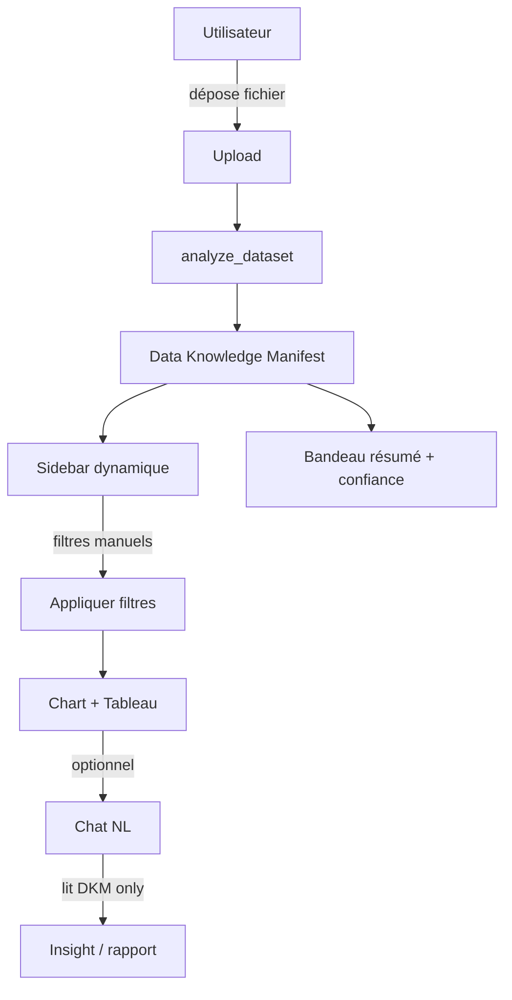

# Parcours utilisateur — Upload → Savoir → Sidebar → Visualiser → Chat

_Version 1.0 — Juillet 2026_  
**Document P0** — à lire en premier par tout développeur ou assistant IA.

---

## 1. Résumé en 30 secondes

```text
Upload Excel/CSV
  → Analyse silencieuse (5–15 s)
  → Data Knowledge Manifest (ce qu'il y a dedans)
  → Sidebar : propriétés des colonnes pour filtrer
  → Zone centrale : graphiques + tableau
  → (V2+) Chat : questions en français sur les savoirs déjà calculés
```

**Aucune visualisation avant l'analyse.** L'utilisateur voit d'abord un résumé (« 10 000 lignes, 15 colonnes, CA détecté… »).

---

## 2. Diagramme de flux



---

## 3. Étapes détaillées

### Étape 0 — Arrivée

- **Persona :** analyste métier, commercial, chargé de mission rénovation — pas data scientist.
- **Attente :** « Je dépose mon fichier, le système comprend sans que je configure. »
- **UI :** zone drag-and-drop + formats acceptés `.csv`, `.xlsx`, `.xls` (max configurable, ex. 50 Mo / 500k lignes).

### Étape 1 — Upload

| Action système | Feedback utilisateur |
|----------------|---------------------|
| Valider extension, taille | Barre progression |
| Stocker `source` + `dataset_id` | « Fichier reçu » |
| Lancer `analyze_dataset` async | Spinner « Analyse en cours… » |

**Erreurs :** fichier vide, une seule colonne, encodage illisible → message + `quality.validation.errors`.

### Étape 2 — Analyse silencieuse (80 % auto)

Services exécutés **sans interaction** (ordre recommandé) :

1. `DatasetLoader` — lecture pandas, encodage, `meta.row_count`
2. `SchemaProfiler` — noms colonnes, dtypes bruts
3. `TypeInferencer` — `inferred_type`, `cardinality`, `filter_widget`
4. `QualityAnalyzer` — nulls, doublons, `confidence`
5. `MetricAggregator` (léger) — sommes/moyennes sur colonnes `measure` détectées
6. `InsightComposer` — `insights.summary_fr` + `suggested_questions`

**Durée cible :** < 15 s pour 10k lignes ; < 60 s pour 100k (CPU).

**Sortie :** `knowledge_manifest.json` persisté.

### Étape 3 — « Savoir ce qu'il y a dedans »

**Écran d'accueil dataset** (avant charts) :

| Zone | Contenu source DKM |
|------|-------------------|
| Bandeau | `insights.summary_fr` |
| Badge qualité | `quality.confidence` — vert ≥ 0.7, orange si `needs_user_review` |
| Liste colonnes | `schema.columns[]` — nom, type, nulls % |
| Questions suggérées | `insights.suggested_questions` (chips cliquables → chat ou chart) |

Si `needs_user_review` :
- Dialogue : « Colonne `montant` ressemble à du texte et des nombres — confirmer type currency ? »
- **20 % manuel** — pas de blocage total, défaut raisonnable proposé.

### Étape 4 — Sidebar filtres dynamiques

- Générée **automatiquement** depuis `schema.columns` où `filter_widget != null`.
- Un contrôle par colonne filtrable (pas de config par dataset).
- Spec widgets : [SIDEBAR_FILTER_SPEC.md](./SIDEBAR_FILTER_SPEC.md).

**Comportement :**
- Changement filtre → debounce 300 ms → `POST /filter` → met à jour chart + tableau.
- Filtres actifs affichés en chips au-dessus du graphique.

### Étape 5 — Visualisation

**Moteur chart générique** (règles par défaut) :

| Condition schema | Chart par défaut |
|------------------|------------------|
| 1 dimension low + 1 measure | Bar chart (sum) |
| time_column + measure | Line chart (sum by month) |
| 2 dimensions low | Stacked bar |
| Aucune measure | Table seule |

**Tableau :** pagination server-side sur sous-ensemble filtré (max 500 lignes preview).

**Compat V1 DPE :** dataset DPE pré-chargé peut ouvrir directement vues `batiment` / `dpe` / `types` via `views.legacy_dashboard`.

### Étape 6 — Chat NL (jalon D+)

- Panneau latéral ou drawer « Poser une question ».
- Entrée : DKM subset + historique conversation + question NL.
- Sortie : texte + optionnel `chart_spec` + citations `metrics.items[].id`.
- **Jamais** relecture du fichier source entier.

Exemples :
- « CA par mois en 2024 »
- « Top 5 arrondissements classe F »
- « Où investir en rénovation privée ? »

---

## 4. Parcours V1 actuel (régression)

| Étape V1 | Équivalent V2 |
|----------|---------------|
| `python DEMARRER.py` → dashboard | Dataset DPE id=builtin |
| `fetchDashboardData()` 6 JSON | `views.legacy_dashboard` + DKM |
| Filtres `mainController.filters` | Sidebar + filtres DPE mappés |

**SC-REGRESSION-DPE :** même charts, + bandeau DKM + sidebar enrichie.

---

## 5. États UI (machine à états)

```text
uploaded → analyzing → analyzed → filtering → visualizing
                              ↓
                         review_required (dialogue)
                              ↓
                         analyzed
```

| État | Boutons actifs |
|------|----------------|
| `analyzing` | Aucun filtre |
| `analyzed` | Sidebar + « Voir graphique » |
| `review_required` | Modal confirmation types |
| `visualizing` | Export, chat |

---

## 6. Non-fonctionnel

| Exigence | Cible |
|----------|-------|
| Privacy | Analyse locale par défaut |
| LLM | OpenRouter / Ollama optionnel — fallback règles sans LLM |
| Auth | `@login_required` Django (existant) |
| Mobile | Sidebar collapsible |

---

## 7. Maquettes textuelles (layout)

```text
┌──────────────────────────────────────────────────────────────┐
│ [Upload]  ventes_2024.xlsx  │  Confiance 0.92  │  Chat 💬  │
├──────────────┬───────────────────────────────────────────────┤
│  SIDEBAR     │  Résumé: 10k lignes, CA 1.25M€, 45 produits │
│  ─────────   │  ┌─────────────────────────────────────────┐ │
│  □ date      │  │         [ Chart principal ]             │ │
│  □ produit   │  └─────────────────────────────────────────┘ │
│  □ montant   │  ┌─────────────────────────────────────────┐ │
│  ...         │  │         [ Tableau paginé ]              │ │
│              │  └─────────────────────────────────────────┘ │
└──────────────┴───────────────────────────────────────────────┘
```

---

_Parcours utilisateur V1 — référence implémentation UI + API_
